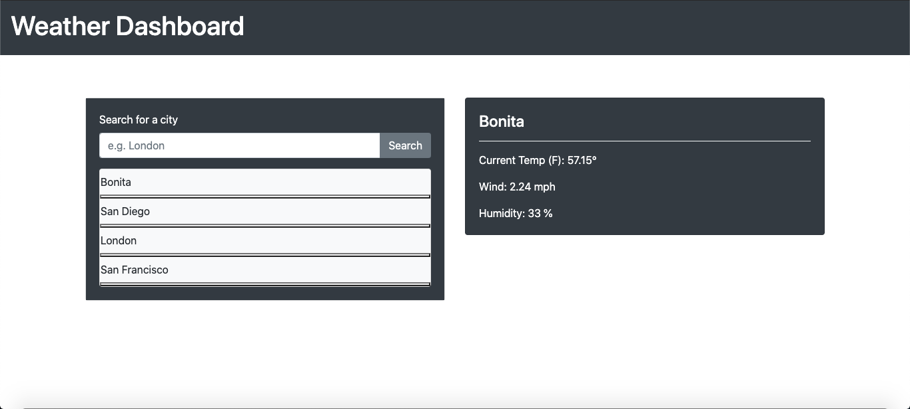

# WeatherDashboard
https://romanrangel.github.io/WeatherDashboard/

## What it does:
This application allows the user to inout a specific city in the textbox, and the application returns the weather for the current day. The search inout is logged into a list, so the user can see what cities they have searched.